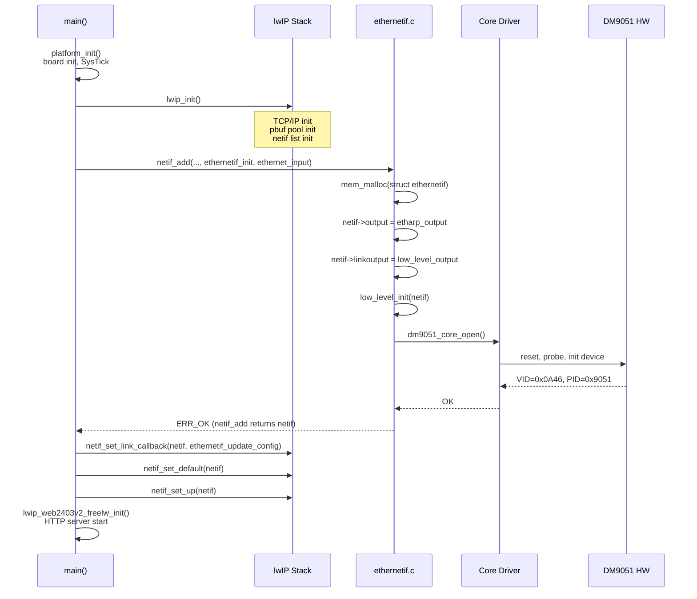
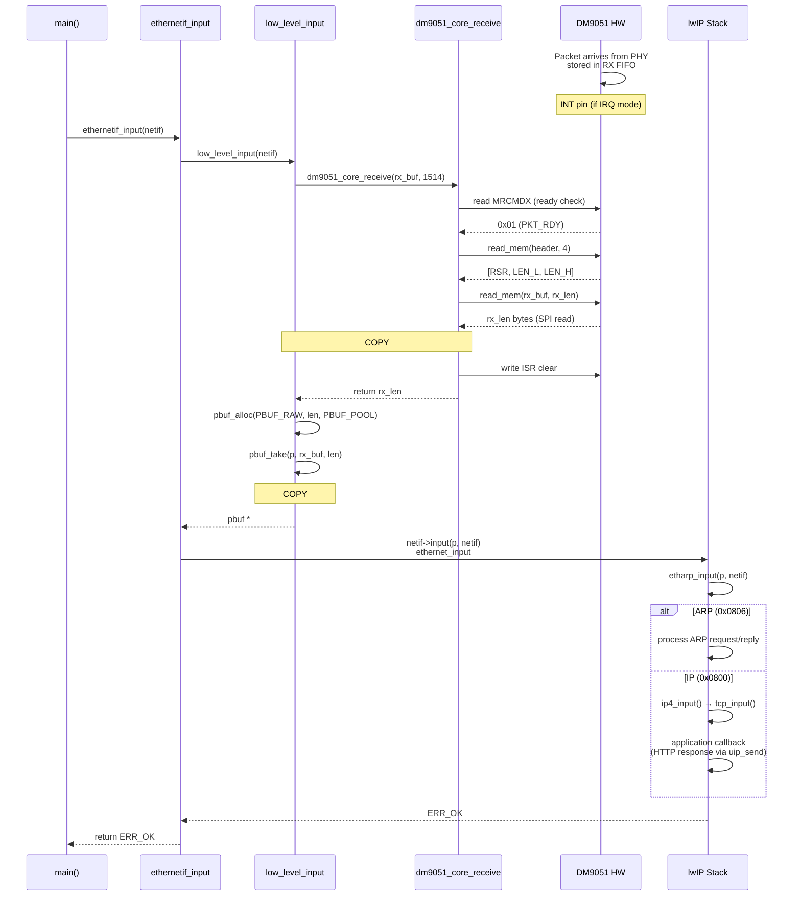
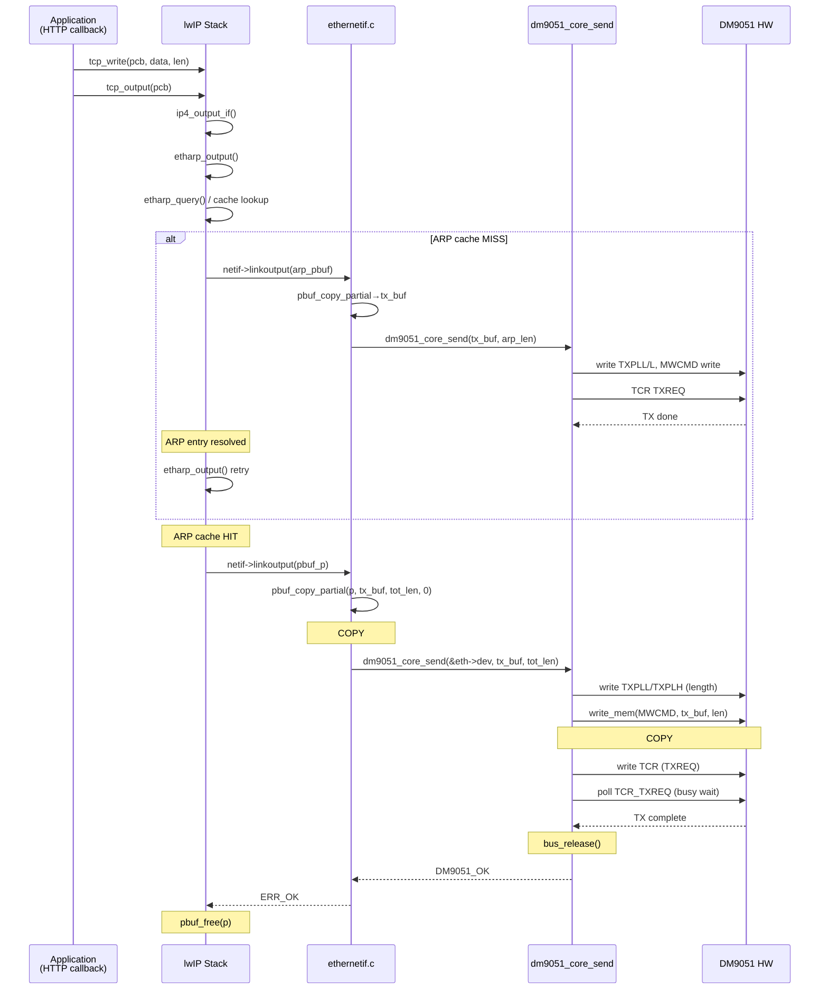
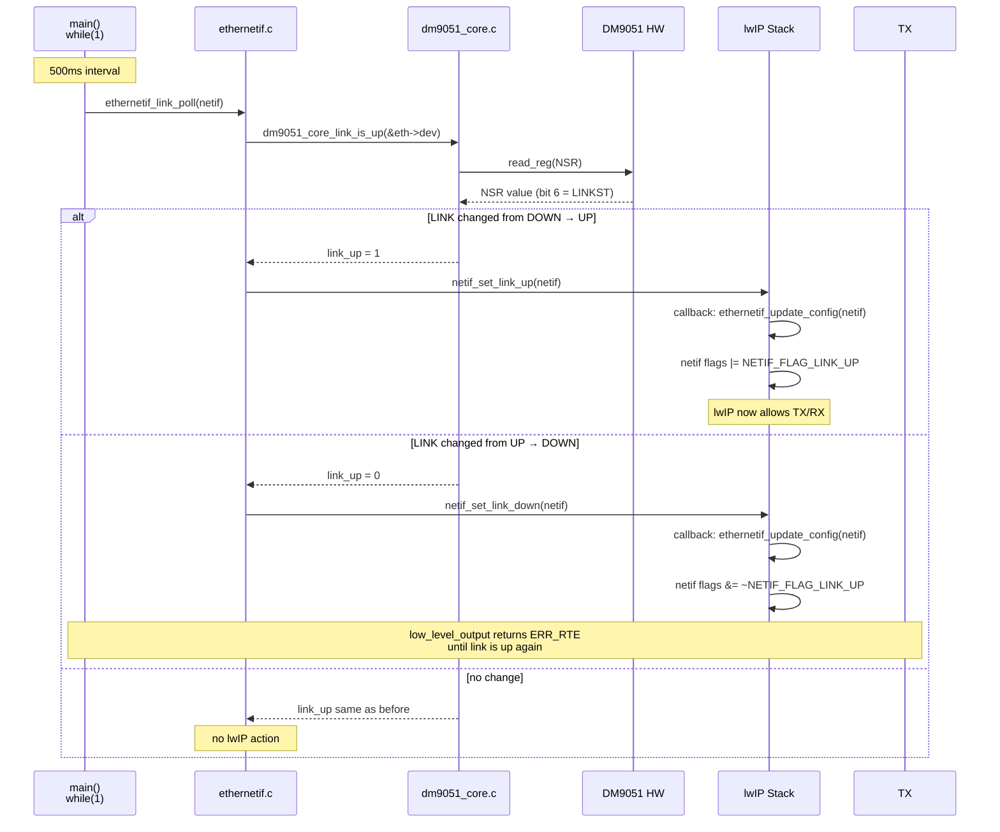
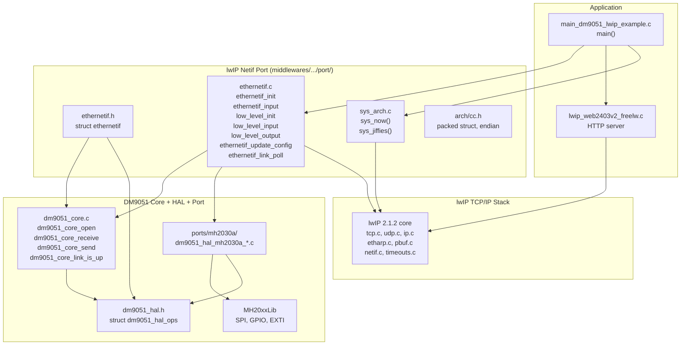

# DM9051 lwIP Adapter Layer 深度分析

> **專案**: MH2030_Demo  
> **MCU**: MH2030A (MH20xx, ARM Cortex-M0 via MH20xxLib)  
> **Ethernet**: DM9051 (SPI 介面)  
> **TCP/IP Stack**: lwIP 2.1.2  
> **RTOS**: Bare-metal (NO_SYS=1)

> **變更記錄**: commit `546d242` 已移除 `adapters/lwip/dm9051_lwip.c` / `.h` 相容包裝層。
> lwIP 適配邏輯已完全集中在 `middlewares/3rd_party/lwip-2.1.2/port/ethernetif.c` / `.h`。
> `adapters/lwip/` 目錄僅保留 `lwipopts.h` 編譯選項。
> 應用層直接呼叫 `ethernetif_init()`、`ethernetif_input()`、`ethernetif_link_poll()`。
> 本文檔已全面更新反映當前狀態；舊相容包裝層內容已移除。

---

## 1. 架構總覽

```
┌──────────────────────────────────────────────────────────────────┐
│                     Application Layer                            │
│  main_dm9051_lwip_example.c                                      │
│  lwip_web2403v2_freelw (HTTP server)                             │
└──────────────────────────┬───────────────────────────────────────┘
                           │
┌──────────────────────────▼───────────────────────────────────────┐
│                    lwIP TCP/IP Stack                             │
│  (middlewares/3rd_party/lwip-2.1.2/)                             │
│  tcp.c, udp.c, ip.c, etharp.c                                    │
│  pbuf chain model, raw callback API                              │
│  netif abstraction, ethernet_input                               │
└──────────────────────────┬───────────────────────────────────────┘
                           │
┌──────────────────────────▼───────────────────────────────────────┐
│             標準 lwIP Netif 移植層 (唯一 Adapter)                 │
│                                                                  │
│  (middlewares/3rd_party/lwip-2.1.2/port/)                        │
│  ethernetif.h / ethernetif.c                                     │
│  ethernetif_init() — netif_add callback (init HW)                │
│  ethernetif_input() — RX poll + feed lwIP                        │
│  ethernetif_link_poll() — PHY link status polling                │
│  ethernetif_update_config() — link change callback               │
└──────────────────────────┬───────────────────────────────────────┘
                           │
┌──────────────────────────▼───────────────────────────────────────┐
│                    DM9051 Core Driver                            │
│  (core/src/dm9051_core.c, core/inc/dm9051_core.h)                │
│  dm9051_core_open(), dm9051_core_receive(),                      │
│  dm9051_core_send(), dm9051_core_link_is_up()                    │
└──────────────────────────┬───────────────────────────────────────┘
                           │
┌──────────────────────────▼───────────────────────────────────────┐
│                    HAL Abstraction Layer                         │
│  (hal/inc/dm9051_hal.h)                                          │
│  struct dm9051_hal_ops { read_reg, write_reg, read_mem,          │
│    write_mem, reset, delay_ms, delay_us,                         │
│    irq_enable, irq_disable, enter_critical, exit_critical }      │
└──────────────────────────┬───────────────────────────────────────┘
                           │
┌──────────────────────────▼───────────────────────────────────────┐
│                    MH2030A Platform Port                         │
│  (ports/mh2030a/)                                                │
│  dm9051_hal_mh2030a_spi1.c      -- SPI polling implementation    │
│  dm9051_hal_mh2030a_spi1_dma.c  -- SPI DMA implementation        │
│  dm9051_hal_mh2030a_int.c       -- EXTI/IRQ handling             │
│  delay.c / mh2030a_board.c      -- Delay / Board setup           │
└──────────────────────────┬───────────────────────────────────────┘
                           │
┌──────────────────────────▼───────────────────────────────────────┐
│                    MCU HAL / Peripheral Layer                    │
│  (MH20xxLib / MH2030A Standard Peripheral Library)               │
│  CMSIS: core_cm0.h (Cortex-M0)                                   │
└──────────────────────────────────────────────────────────────────┘
```

### 分層職責

| Layer | 職責 | 檔案位置 |
|-------|------|----------|
| **Application** | 網路應用邏輯, main loop, link detection, HTTP server | `examples/lwip_mh2030a_demo/main_dm9051_lwip_example.c` |
| **lwIP Stack** | TCP/IP 協定處理, ARP, pbuf 管理, timer | `middlewares/3rd_party/lwip-2.1.2/` |
| **Adapter netif 移植** | 標準 lwIP netif init/input/link poll 實作 | `middlewares/3rd_party/lwip-2.1.2/port/ethernetif.c` |
| **lwIP 組態** | lwIP 編譯選項 (lwipopts.h) | `adapters/lwip/lwipopts.h` |
| **Core Driver** | DM9051 初始化, PHY 存取, RX/TX 流程 | `core/src/dm9051_core.c` |
| **HAL** | SPI register/memory 讀寫抽象介面 | `hal/inc/dm9051_hal.h` |
| **Platform Port** | MCU 專屬 SPI 實作 (polling/DMA), GPIO, EXTI, SysTick | `ports/mh2030a/` |

---

## 2. 實體目錄與檔案階層

### 2.1 完整目錄樹 (DM9051 Driver 相關)

```
dm9051_driver/
│
├── adapters/
│   ├── lwip/                                    ← lwIP 組態 (僅 lwipopts.h)
│   │   └── lwipopts.h                          ← lwIP 編譯選項
│   │
│   └── uip/                                    ← uIP adapter (另一個 stack)
│       ├── dm9051_uip.c
│       ├── dm9051_uip.h
│       ├── dm9051_uip_stack.c
│       └── dm9051_uip_stack.h
│
├── core/                                        ← DM9051 核心 driver
│   ├── inc/
│   │   ├── dm9051_core.h
│   │   ├── dm9051_regs.h
│   │   └── dm9051_types.h
│   └── src/
│       ├── dm9051_core.c
│       └── dm9051_debug.c
│
├── docs/                                        ← 設計文件
├── examples/
│   └── lwip_mh2030a_demo/
│       ├── main_dm9051_lwip_example.c          ← lwIP main 範例 (直接呼叫 ethernetif_*)
│       └── README.md
├── hal/
│   └── inc/
│       └── dm9051_hal.h
└── ports/
    └── mh2030a/                                ← MH2030A 平台移植
```

### 2.2 lwIP Port 層檔案

```
middlewares/3rd_party/lwip-2.1.2/port/
│
├── ethernetif.c                                ← 標準 netif 移植 (核心實作)
├── ethernetif.h                                ← netif 移植 header
├── sys_arch.c                                  ← NO_SYS 系統抽象層 (sys_now, sys_jiffies)
└── arch/
    ├── cc.h                                    ← 編譯器相關 (packed struct, endian, assert)
    └── sys_arch.h                              ← 系統抽象 header
```

### 2.3 目錄與分層對應

| 目錄 | 對應架構層 | 角色 |
|------|-----------|------|
| `adapters/lwip/` | **lwIP 組態** | `lwipopts.h` (僅編譯選項，無程式碼) |
| `middlewares/3rd_party/lwip-2.1.2/port/` | **Netif 移植層** | 標準 lwIP netif init/input/linkoutput/link poll |
| `core/` | DM9051 Core Driver | 裝置初始化、RX/TX、PHY、IRQ |
| `hal/` | HAL Abstraction | SPI register/mem 操作抽象介面 |
| `ports/mh2030a/` | Platform Port | MH2030A SPI/GPIO/IRQ/SysTick 實作 |
| `examples/` | Application 範例 | main() + demo 流程 |

---

## 3. 檔案用途分析

### 3.1 `ethernetif.h` — Netif 移植 Public API

```c
// ====== 標準 netif 介面 (適用於進階用法) ======
err_t ethernetif_init(struct netif *netif);              // netif_add init callback
err_t ethernetif_input(struct netif *netif);             // 輪詢 RX 並餵入 lwIP
void ethernetif_update_config(struct netif *netif);      // link 狀態變更回呼
void ethernetif_link_poll(struct netif *netif);           // PHY link 輪詢 (100-500ms)

```

- 不再有 `dm9051_lwip_*` 包裝 API — 應用層直接使用標準 `ethernetif_*` 介面

### 3.2 `ethernetif.c` — 標準 Netif 移植實作 (核心 Adapter)

| 函式 | 角色 | 委託 Core Driver |
|------|------|-----------------|
| `low_level_init()` | 硬體初始化 | `dm9051_core_open()` + `dm9051_mh2030a_hal_bind()` |
| `low_level_output()` | TX: pbuf → DM9051 | `dm9051_core_send()` |
| `low_level_input()` | RX: DM9051 → pbuf | `dm9051_core_receive()` |
| `ethernetif_init()` | netif_add init callback | 配置 `struct ethernetif` + 呼叫 `low_level_init()` |
| `ethernetif_input()` | RX poll entry | 呼叫 `low_level_input()` → `netif->input()` |
| `ethernetif_update_config()` | Link change callback | `dm9051_core_link_is_up()` |
| `ethernetif_link_poll()` | 定時 link 輪詢 | `dm9051_core_link_is_up()` + `netif_set_link_up/down()` |

- `adapters/lwip/` 目錄已無 `dm9051_lwip.c` / `.h` — 相容包裝層已完全移除 (commit `546d242`)
- 所有 lwIP 適配邏輯僅此一組檔案，無雙層包裝

### 3.3 `lwipopts.h` — lwIP 編譯選項

| 選項 | 值 | 說明 |
|------|-----|------|
| `NO_SYS` | 1 | Bare-metal, 無 RTOS |
| `LWIP_IPV4` / `LWIP_IPV6` | 1 / 0 | 僅 IPv4，無 IPv6 |
| `LWIP_ARP` | 1 | 支援 ARP |
| `LWIP_ETHERNET` | 1 | 支援 Ethernet frame 格式 |
| `LWIP_CALLBACK_API` | 1 | 使用 raw callback API |
| `LWIP_ALTCP` | 1 | 啟用 altcp 層 (HTTPD 使用) |
| `MEM_SIZE` | 12KB | lwIP heap 大小 |
| `MEMP_NUM_PBUF` | 8 | pbuf 結構數量 |
| `PBUF_POOL_SIZE` | 8 | pbuf pool 數量 |
| `PBUF_POOL_BUFSIZE` | 1536 | 每個 pool pbuf 大小 (可容納 Ethernet frame) |
| `MEMP_NUM_TCP_PCB` | 4 | TCP 連線數 |
| `MEMP_NUM_TCP_PCB_LISTEN` | 4 | TCP listen PCB 數 |
| `MEMP_NUM_TCP_SEG` | 16 | TCP segment 數量 |
| `TCP_SND_BUF` | 4×MSS | 傳送 buffer (~5840 bytes) |
| `TCP_WND` | 2×MSS | 接收 window (~2920 bytes) |
| `LWIP_NETIF_LINK_CALLBACK` | 1 | 啟用 link callback 機制 |
| `CHECKSUM_GEN_*` / `CHECKSUM_CHECK_*` | 1 | 軟體 checksum (DM9051 無 offload) |
| `LWIP_DHCP` | 0 | 未啟用 DHCP (靜態 IP) |
| `LWIP_STATS` | 0 | 關閉統計 (節省 ROM) |

HTTPD 相關設定 (由 `apps/lwip_web2403v2_freelw` 使用):

| 選項 | 值 | 說明 |
|------|-----|------|
| `LWIP_HTTPD_SUPPORT_REQUESTLIST` | 1 | 啟用 request 佇列 |
| `LWIP_HTTPD_REQ_QUEUELEN` | 5 | 最大佇列長度 |
| `LWIP_HTTPD_DYNAMIC_HEADERS` | 1 | 動態 header 支援 |
| `HTTPD_SERVER_PORT` | 80 | HTTP 服務埠 |
| `HTTPD_SERVER_AGENT` | `"MH2030-DM9051A/lwIP"` | Server agent 字串 |

### 3.4 `ethernetif.h` — Netif 移植 Private Data

```c
struct ethernetif {
    dm9051_device_t dev;             // DM9051 裝置實例
    dm9051_hal_t    hal;             // HAL vtable 綁定
    uint8_t         rx_buf[1514];    // RX 連續 buffer (SPI read 需要)
    uint8_t         tx_buf[1514];    // TX 連續 buffer (SPI write 需要)
};
```

- `netif->state` 指向 `struct ethernetif` (由 `ethernetif_init` 配置)
- `rx_buf` 和 `tx_buf` 為連續記憶體區塊，因 DM9051 SPI `read_mem`/`write_mem` 需要連續 buffer

### 3.5 `ethernetif.c` — 標準 lwIP Netif 移植 (核心實作)

```c
// Internal (static) functions
static void low_level_init(struct netif *netif);           // HW init: HAL bind + core_open
static err_t low_level_output(struct netif *netif, struct pbuf *p);  // TX path
static struct pbuf *low_level_input(struct netif *netif);             // RX path

// Public API
err_t ethernetif_init(struct netif *netif);                // netif_add callback
err_t ethernetif_input(struct netif *netif);               // RX poll entry
void ethernetif_update_config(struct netif *netif);        // link change callback
void ethernetif_link_poll(struct netif *netif);            // PHY link 狀態輪詢
```

---

## 4. Netif 註冊流程

### 4.1 `netif_add()` 初始化的標準流程

```c
lwip_init();                              // lwIP stack init (一次)

netif_add(&netif, &ip, &mask, &gw,       // 註冊 netif
          NULL,                           // state (ethernetif_init 會 malloc)
          ethernetif_init,                // ← init callback
          ethernet_input);                // ← input callback (接收 Ethernet frame)

netif_set_link_callback(netif, ethernetif_update_config);  // ← link callback
netif_set_default(&netif);
netif_set_up(&netif);
```

### 4.2 `ethernetif_init()` 內部流程

```
netif_add() → ethernetif_init()
  │
  ├── [if state==NULL] mem_malloc(struct ethernetif)  ← 配置 private data
  │
  ├── netif->output     = etharp_output               ← IP 封包輸出
  ├── netif->linkoutput = low_level_output             ← L2 封包輸出
  ├── netif->name[0]    = 'd',  name[1] = 'm'         ← "dm" netif
  │
  └── low_level_init()
        │
        ├── dm9051_core_default_config(&config)
        │     mac_addr = netif->hwaddr
        │     interrupt_mode = POLL or IRQ (由 DM9051_MH2030A_USE_IRQ 決定)
        │     flow_control = 0
        │
        ├── dm9051_mh2030a_default_config(&port_config)
        │     transport = POLLING or DMA (由 DM9051_MH2030A_USE_DMA 決定)
        │     irq_mode  = EXTI or OFF (由 DM9051_MH2030A_USE_IRQ 決定)
        │
        ├── dm9051_mh2030a_hal_bind(&eth->hal, &port_config)  ← 綁定 HAL vtable
        │
        ├── [if IRQ] dm9051_mh2030a_irq_attach_device(&eth->dev)
        │
        ├── dm9051_core_open(&eth->dev, &core_config, &eth->hal)
        │     ├── hal->ops->reset()
        │     ├── dm9051_core_probe()        ← VID/PID/CHIPR check
        │     ├── dm9051_core_init_device()  ← Reset + register init
        │     ├── dm9051_core_set_par()      ← MAC
        │     └── dm9051_core_start_receive()← RX enable
        │
        ├── active_mac = dm9051_core_mac(&eth->dev)  ← 回讀有效 MAC
        └── netif flags |= NETIF_FLAG_BROADCAST | NETIF_FLAG_ETHARP | NETIF_FLAG_ETHERNET
```

### 4.3 Netif 註冊流程圖 (Mermaid)



---

## 5. API 對應分析

### 5.1 lwIP Stack API 與 Adapter 對應

| lwIP 角色 | Adapter API | Core Driver API | 說明 |
|-----------|-------------|-----------------|------|
| Init | `ethernetif_init()` → `low_level_init()` | `dm9051_core_open()` | 硬體初始化 + netif 綁定 |
| RX frame | `ethernetif_input()` → `low_level_input()` | `dm9051_core_receive()` | 讀取 RX frame → pbuf |
| TX frame | `low_level_output()` | `dm9051_core_send()` | pbuf chain → tx_buf → TX FIFO |
| Link poll | `ethernetif_link_poll()` | `dm9051_core_link_is_up()` | 讀 NSR bit 6 |
| Link callback | `ethernetif_update_config()` | `dm9051_core_link_is_up()` | 由 `netif_set_link_callback` 觸發 |
| TX linkoutput | `netif->linkoutput` → `low_level_output` | `dm9051_core_send()` | lwIP TX 進入點 |
| L3 output | `netif->output` → `etharp_output` | — | lwIP ARP 處理後 call linkoutput |

### 5.2 API 入口對比

| 使用場景 | 建議 API | 複雜度 |
|----------|----------|--------|
| 自訂 netif + 自行管理 IP | `netif_add()` + `ethernetif_init()` + `ethernetif_input()` | 高 |
| 完整 demo (含 HTTP server) | `main_dm9051_lwip_example.c` 範例 | 低 (複製貼上) |

---

## 6. RX 封包流程

### 6.1 完整 RX 路徑

```
[Main Loop]                              [main_dm9051_lwip_example.c:158]
    │
    ├── lwip_link_poll_wrapper()         ← link 狀態監測 (500ms, 內部呼叫 ethernetif_link_poll)
    │
    └── ethernetif_input(&g_dm9051_netif)
            │
            └── p = low_level_input(netif)
                │
                ├── dm9051_core_receive(&eth->dev, eth->rx_buf, 1514)
                │   └── dm9051_core_rx_ready()       ← read MRCMDX × 2
                │   └── dm9051_core_rx_header()       ← read_mem(header, 4)
                │   └── dm9051_core_read_mem(buf, len)← read_mem(rx_buf, len)
                │       *** COPY #1: SPI FIFO → eth->rx_buf (連續 buffer) ***
                │   └── write_reg(ISR, ISR_CLEAR_RX)
                │
                ├── [len == 0] → return NULL
                ├── [len > eth->rx_buf size] → drop, return NULL
                ├── [if ETHERNETIF_RX_STRIP_FCS] len -= 4
                ├── [len < 14] → drop, return NULL
                │
                └── p = pbuf_alloc(PBUF_RAW, len, PBUF_POOL)
                    │
                    ├── [alloc fail] → drop, return NULL
                    │
                    └── pbuf_take(p, eth->rx_buf, len)  ← 複製 rx_buf → pbuf
                        *** COPY #2: eth->rx_buf → pbuf chain ***
                        │
                        └── [fail] → pbuf_free(p), return NULL
                        │
                        return p    ← 成功回傳 pbuf
            │
            ├── [p == NULL] → return ERR_INPROGRESS
            │
            ├── [if link down] → netif_set_link_up(netif)
            │
            └── netif->input(p, netif)   ← ethernet_input(p, netif)
                └── etharp_input()       ← ARP or IP dispatcher
                    ├── [ARP] → process ARP
                    └── [IP]  → ip4_input() → tcp_input() / udp_input()
                                └── application callback (e.g., httpd)
```

### 6.2 RX 封包複製分析

| 步驟 | 複製方向 | 次數 | Buffer |
|------|---------|------|--------|
| SPI FIFO → `eth->rx_buf` | RX DMA copy | 1 | `rx_buf[1514]` (連續) |
| `rx_buf` → `pbuf` chain | Memory copy | 1 | lwIP managed pbuf |

**總計**: 2 次完整複製 (1 SPI + 1 memory copy)。

**Zero-copy 限制**:  
- DM9051 SPI `read_mem` 需要連續目標 buffer，無法直接讀入 pbuf chain 的非連續片段  
- `rx_buf` 中介 buffer 是必需的 — 先 SPI 讀入連續 buffer，再用 `pbuf_take` 複製到 pbuf chain  

### 6.3 RX 流程 (Mermaid)



---

## 7. TX 封包流程

### 7.1 完整 TX 路徑

```
Application 產生回應 (TCP callback)
    │
    ├── tcp_write(pcb, data, len)              ← 寫入 TCP send buffer
    ├── tcp_output(pcb)                        ← 觸發傳送
    │   └── ip4_output_if() → etharp_output()  ← ARP resolve
    │       ├── [ARP cache miss] → etharp_request() → low_level_output()
    │       │                                    ← 先發 ARP request
    │       └── [ARP cache hit] → etharp_output()
    │           └── netif->linkoutput(p)        ← low_level_output()
    │
    └── low_level_output(netif, p)
        │
        ├── [if link down] → return ERR_RTE
        ├── [if p->tot_len > tx_buf size] → return ERR_BUF
        │
        ├── pbuf_copy_partial(p, eth->tx_buf, p->tot_len, 0)
        │   *** COPY #1: pbuf chain → eth->tx_buf (連續 buffer) ***
        │
        └── dm9051_core_send(&eth->dev, eth->tx_buf, p->tot_len)
            ├── dm9051_core_bus_acquire()
            ├── dm9051_core_tx_set_len(hal, len)    ← TXPLL, TXPLH
            ├── dm9051_core_write_mem(hal, buf, len)
            │   └── hal->ops->write_mem(ctx, buf, len)
            │       *** COPY #2: eth->tx_buf → SPI TX FIFO ***
            ├── write_reg(hal, TCR, TCR_TXREQ)      ← 觸發 TX
            ├── [if TX_WAIT_DONE] dm9051_core_tx_wait_done(hal)
            │   └── busy-poll TCR_TXREQ (max 100ms)
            └── dm9051_core_bus_release()
```

### 7.2 TX 封包複製分析

| 步驟 | 複製方向 | 次數 | Buffer |
|------|---------|------|--------|
| lwIP pbuf chain → `eth->tx_buf` | Memory copy | 1 | `tx_buf[1514]` (連續) |
| `tx_buf` → SPI TX FIFO | SPI DMA copy | 1 | SPI transaction |

**總計**: 2 次完整複製 (1 memory copy + 1 SPI)。

**Zero-copy 限制**:  
- lwIP pbuf 可能為 chain (非連續)，DM9051 SPI `write_mem` 需要連續 source buffer  
- `tx_buf` 中介 buffer 是必需的 — 先用 `pbuf_copy_partial` 攤平到連續 buffer，再進行 SPI write  

### 7.3 TX 流程 (Mermaid)



---

## 8. Link Up/Down 處理機制

### 8.1 硬體 Link 狀態偵測

```c
dm9051_core_link_is_up(&eth->dev)
  └── read_reg(hal, NSR, &nsr)                // Network Status Register
      └── return (nsr & NSR_LINKST) != 0;    // bit 6: LINKST
```

### 8.2 兩種 Link 更新路徑

#### 路徑 A: `ethernetif_link_poll()` (應用層輪詢)

```c
// ethernetif.c — 應用層定期呼叫 (建議 100-500ms)
ethernetif_link_poll(netif)
  ├── eth = (struct ethernetif *)netif->state
  ├── link_up = dm9051_core_link_is_up(&eth->dev)
  │
  ├── [link_up && !netif_is_link_up] → netif_set_link_up(netif)
  │   └── 觸發 link callback: ethernetif_update_config()
  │
  └── [!link_up && netif_is_link_up] → netif_set_link_down(netif)
      └── 觸發 link callback: ethernetif_update_config()
```

#### 路徑 B: `ethernetif_update_config()` (lwIP Link Callback + PHY 輪詢)

```c
// ethernetif.c — 由 netif_set_link_callback 註冊
// 每當 netif_set_link_up/down 被呼叫時觸發，同時也實際輪詢 PHY 硬體
ethernetif_update_config(netif)
  ├── eth = (struct ethernetif *)netif->state
  ├── link_up = dm9051_core_link_is_up(&eth->dev)   // 真正讀取 NSR bit 6
  │
  ├── [link_up && !netif_is_link_up] → netif_set_link_up(netif)
  └── [!link_up && netif_is_link_up] → netif_set_link_down(netif)
```

### 8.3 Link Detection 在 Main Loop 中的位置

```c
// main_dm9051_lwip_example.c
int main(void)
{
    platform_init();
    network_init();

    while (1) {
        lwip_link_poll_wrapper(&g_dm9051_netif);   // 500ms link poll (內部 ethernetif_link_poll)
        ethernetif_input(&g_dm9051_netif);          // RX 輪詢
        sys_check_timeouts();                       // lwIP timer
        lwip_web2403v2_freelw_poll();              // 應用層 hook
    }
}
```

### 8.4 Link 狀態變化流程圖 (Mermaid)



---

## 9. ISR 與 Main Loop 分工

### 9.1 中斷模式 (`DM9051_MH2030A_USE_IRQ=1`)

```
[DM9051 INT Pin] (硬體中斷)
    │
    ▼
[EXTI ISR]                                     [ports/mh2030a/dm9051_hal_mh2030a_int.c]
    │
    ├── 清除 EXTI pending bit
    ├── hal->ops->irq_disable()                ← 關閉 EXTI (防止巢狀中斷)
    │
    └── dm9051_core_interrupt_set(dev, irq_line)
        └── dev->runtime.interrupt_event = 1   ← 設定 event flag

    *** ISR 結束 — 不進行任何 SPI 操作 ***
```

```
[Main Loop]                                    [main_dm9051_lwip_example.c]
    │
    ├── lwip_link_poll_wrapper(netif)          ← 500ms link 監測 (內部 ethernetif_link_poll)
    │
    ├── [if IRQ mode: interrupt_event flag]
    │     └── ethernetif_input(netif)          ← 進入 RX 處理
    │
    ├── sys_check_timeouts()                   ← lwIP timer 處理
    │
    └── lwip_web2403v2_freelw_poll()           ← 應用層 hook
```

### 9.2 Polling 模式 (`DM9051_MH2030A_USE_IRQ=0`)

```
[Main Loop]
    │
    ├── lwip_link_poll_wrapper(netif)
    │
    ├── ethernetif_input(netif)               ← 每次 loop 都輪詢 RX (polling)
    │     └── low_level_input(netif)          ← 直接讀取 DM9051 RX FIFO
    │
    ├── sys_check_timeouts()
    │
    └── lwip_web2403v2_freelw_poll()
```

### 9.3 ISR / Main Loop 分工表格

| 項目 | ISR Context | Main Loop Context | 說明 |
|------|------------|------------------|------|
| SPI 操作 | ❌ 禁止 | ✅ 唯一執行者 | DM9051 SPI 僅在 main loop 中操作 |
| `dm9051_core_receive()` | ❌ 禁止 | ✅ 透過 `ethernetif_input()` | RX 流程完全在主迴圈 |
| `dm9051_core_send()` | ❌ 禁止 | ✅ 透過 `low_level_output()` | TX 由 lwIP callback 在主迴圈觸發 |
| `interrupt_event` flag | ✅ 寫入 (volatile) | ✅ 讀取/清除 | ISR 只設 flag，main loop 消費 |
| EXTI/NVIC 控制 | ❌ 禁止 re-enable | ✅ 透過 `interrupt_reset()` | ISR 關閉 IRQ，main loop 重新啟用 |
| lwIP `netif->input()` | ❌ 禁止 | ✅ 在 `ethernetif_input()` 中 | pbuf 操作不使用 critical section |
| `sys_check_timeouts()` | ❌ 禁止 | ✅ 主迴圈呼叫 | lwIP timer 需要可重入 context |
| `pbuf_alloc()` / `pbuf_free()` | ❌ 禁止 | ✅ 在 `low_level_input/output` | pbuf pool 操作非 ISR-safe (NO_SYS=1) |

---

## 10. PBUF 使用分析

### 10.1 pbuf 類型使用

| pbuf 類型 | 使用位置 | 用途 |
|-----------|---------|------|
| `PBUF_RAW` | `low_level_input()` | RX: `pbuf_alloc(PBUF_RAW, len, PBUF_POOL)` |
| `PBUF_RAW` | `low_level_output()` | TX: 由 lwIP 的 etharp 層傳入 |
| `PBUF_POOL` | `low_level_input()` | RX: 使用 pool 分配 (避免 heap fragmentation) |

### 10.2 各類 pbuf 說明

| 類型 | 特性 | 在本專案的使用 |
|------|------|-------------|
| **PBUF_POOL** | 固定大小的 pbuf pool, 分配快速, 無碎片 | RX: 每次 `low_level_input` 分配一個 pool pbuf 鏈來裝載 Ethernet frame |
| **PBUF_RAM** | heap 分配的 pbuf, 大小可變 | TX: lwIP 內部 TCP 輸出使用 RAM pbuf |
| **PBUF_REF** | 參考外部 buffer, 不複製 | 未使用 |
| **PBUF_ROM** | 參考 ROM 資料, 不複製 | 未使用 |

### 10.3 Pool 配置

```c
// lwipopts.h
#define PBUF_POOL_SIZE      8       // 最多 8 個 pool pbuf
#define PBUF_POOL_BUFSIZE   1536    // 每個 1536 bytes (可容納最大 Ethernet frame)
```

- Pool 能同時容納最多 **8 個 RX frame** (約 12KB)
- 當應用層處理速度 < RX 到達率時，pool 耗盡會導致 `pbuf_alloc()` 回傳 NULL → frame drop
- Pool buffer size (1536) > 實際 MTU (1500) + header (14) = 1514，足夠容納完整 frame

### 10.4 Copy 分析

| 操作 | 複製存在？ | 說明 |
|------|-----------|------|
| RX: SPI → rx_buf | ✅ Copy | DM9051 SPI `read_mem` 需要連續 buffer |
| RX: rx_buf → pbuf | ✅ Copy | `pbuf_take()` 將連續 buffer 複製到 pbuf chain |
| RX: Zero-copy | ❌ 不可行 | DM9051 SPI 無法直接寫入非連續 pbuf chain |
| TX: pbuf → tx_buf | ✅ Copy | `pbuf_copy_partial()` 攤平 pbuf chain 到連續 buffer |
| TX: tx_buf → SPI FIFO | ✅ Copy | DM9051 SPI `write_mem` 需要連續 source |
| TX: Zero-copy | ❌ 不可行 | 同上理由 |

---

## 11. Memory 與效能分析

### 11.1 Memory Usage

| 項目 | 大小 | 位置 | 說明 |
|------|------|------|------|
| `eth->rx_buf` | 1514 bytes | `struct ethernetif` (heap) | RX 連續 buffer |
| `eth->tx_buf` | 1514 bytes | `struct ethernetif` (heap) | TX 連續 buffer |
| `struct ethernetif` | ~80 bytes | heap (mem_malloc) | netif private data + dev + hal |
| lwIP heap (`MEM_SIZE`) | 12 KB | BSS/heap | TCP segments, pbuf RAM, etc. |
| pbuf pool (`PBUF_POOL_SIZE`) | 8 × 1536 = 12 KB | BSS/heap | RX pbuf pool |
| TCP send buffer | 4 × MSS = ~5840 bytes | lwIP heap | `TCP_SND_BUF` |
| TCP receive window | 2 × MSS = ~2920 bytes | lwIP heap | `TCP_WND` |
| DM9051 internal SRAM | 32 KB | DM9051 晶片內部 | RX/TX FIFO |

### 11.2 SPI 傳輸效能

| 操作 | 約略 SPI clock count | @18MHz SPI 耗時 | @36MHz SPI 耗時 |
|------|-------------------|------------------|----------------|
| Read Reg (2 bytes) | 16 clocks | ~0.89μs | ~0.44μs |
| Write Reg (2 bytes) | 16 clocks | ~0.89μs | ~0.44μs |
| Read Mem frame (1518 bytes) | 12144 clocks | ~675μs | ~337μs |
| Write Mem frame (1518 bytes) | 12144 clocks | ~675μs | ~337μs |
| Copy: pbuf → tx_buf (1514B) | — | ~5-10μs (CPU) | ~5-10μs (CPU) |
| Copy: rx_buf → pbuf (1514B) | — | ~5-10μs (CPU) | ~5-10μs (CPU) |

### 11.3 TX Wait Busy Poll 效能

```c
// dm9051_core_tx_wait_done() — tight polling loop
do {
    status = read_reg(hal, DM9051_TCR, &tcr);
    if ((tcr & DM9051_TCR_TXREQ) == 0) return DM9051_OK;
    --timeout;
} while (timeout != 0);   // timeout = 100000 iterations
```

當 `TX_WAIT_POLL_DELAY_US = 0` 時，每次 TX 完成前 CPU 被完全佔用。  
在 120MHz Cortex-M0 上，每次 loop ~15 cycle，最壞情況 ~12.5ms 的 busy wait。

### 11.4 CPU Loading 估算 (滿載 100Mbps)

| 步驟 | 每 frame 耗時 | 每秒 8127 frames (64B) | 每秒 812 frames (1518B) |
|------|--------------|----------------------|-----------------------|
| SPI RX transfer (1518B @36MHz) | ~337μs | 2.74s | 0.27s |
| SPI TX transfer (1518B @36MHz) | ~337μs | 2.74s | 0.27s |
| Memory copy (pbuf ↔ tx_buf) | ~10μs | 0.08s | 0.01s |
| lwIP stack processing | ~50-200μs | 0.4-1.6s | 0.04-0.16s |
| **Total per frame** | **~734-884μs** | **5.96-7.16s** | **0.59-0.71s** |
| **CPU loading** | | **~85%** (64B) | **~8%** (1518B) |

> 注意: 上述為粗略估算。64B 小封包的 CPU loading 最高，大封包則較低。  
> DMA 模式可降低 SPI transfer 的 CPU loading。

---

## 12. lwIP Timer 機制

### 12.1 Timer 處理流程

```c
// main_dm9051_lwip_example.c — main loop
while (1) {
    lwip_link_poll_wrapper(netif);  // 內部 ethernetif_link_poll()
    ethernetif_input(netif);
    sys_check_timeouts();           // ← lwIP 內部 timer 推進
    lwip_web2403v2_freelw_poll();
}
```

### 12.2 Timer 類型

| Timer | 間隔 | 用途 | 觸發方式 |
|-------|------|------|---------|
| TCP fast timer | 250ms | TCP delayed ACK, FIN_WAIT2 | `sys_check_timeouts()` |
| TCP slow timer | 500ms | TCP retransmission, keepalive | `sys_check_timeouts()` |
| ARP timer | 5s | ARP cache cleanup, pending retry | `sys_check_timeouts()` |
| DHCP coarse timer | 60s | DHCP renew/rebind (未啟用) | `sys_check_timeouts()` |
| HTTPD timer | 500ms | HTTP server timeout | `sys_check_timeouts()` |

### 12.3 sys_now() 實作

```c
// port/sys_arch.c
u32_t lwip_sys_now = 0;          // 1ms tick count

u32_t sys_now(void)
{
    return lwip_sys_now;
}

// SysTick_Handler (每 1ms)
void SysTick_Handler(void)
{
    lwip_sys_now++;
}
```

- SysTick 設定為 1ms 中斷 (`SystemCoreClock / 1000`)
- `sys_now()` 提供 milliseconds 時間戳
- 不同於 uIP 使用 10ms tick，lwIP 需要 1ms 精度以支援 TCP RTT 計算

---

## 13. 與 uIP Adapter 的差異比較

### 13.1 架構差異

| 比較項目 | uIP Adapter | lwIP Adapter |
|----------|-------------|-------------|
| Stack 版本 | uIP 1.0 | lwIP 2.1.2 |
| Buffer model | 單一 `uip_buf[UIP_BUFSIZE]` global | pbuf chain (可非連續) |
| TX 路徑 | 同步: `uip_send()` → adapter 直接 TX | 非同步: `tcp_write()` → `tcp_output()` → callback |
| RX 路徑 | `dm9051_uip_input()` 直接寫入 `uip_buf` | `low_level_input()` → `pbuf_alloc()` → `netif->input()` |
| 中斷處理 | `interrupt_take()` + `interrupt_reset()` | 相同模式, 但由 `ethernetif_input()` 處理 |
| Link callback | 無 — 應用層手動 `dm9051_core_link_is_up()` | `netif_set_link_callback()` + `ethernetif_update_config()` |
| init callback | `dm9051_uip_stack_init()` 集中式 | `netif_add()` + `ethernetif_init()` 標準化 |
| Periodics | 手動: `uip_periodic()`, `uip_arp_timer()` | 自動: `sys_check_timeouts()` 驅動內部 timer |
| ARP 處理 | Adapter 層手動判斷 ethertype | lwIP `etherneet_input()` → `etharp_input()` 自動處理 |
| Checksum | 軟體 checksum | 軟體 checksum (DM9051 無 offload) |
| API 風格 | 自訂 `dm9051_uip_*()` | 標準 lwIP netif 介面 + 相容包裝層 |

### 13.2 RAM/ROM 記憶體需求比較

#### 實際建置大小 (Keil ARMCC V5.06, MH2030A)

| 項目 | uIP | lwIP (含 HTTPD) |
|------|-----|-----------------|
| Code | 36,520 bytes | 58,688 bytes |
| RO-data | 27,416 bytes | 27,576 bytes |
| **總 ROM (Code + RO-data)** | **63,936 bytes (~62 KB)** | **86,264 bytes (~84 KB)** |
| RW-data | 324 bytes | 244 bytes |
| ZI-data | 8,780 bytes | 28,844 bytes |
| **總 RAM (RW-data + ZI-data)** | **9,104 bytes (~9 KB)** | **29,088 bytes (~28 KB)** |

#### ROM 使用分析

| 貢獻者 | uIP | lwIP |
|--------|-----|------|
| DM9051 Core + HAL + Port | ~4-6 KB | ~4-6 KB (共用) |
| TCP/IP Stack 本體 | ~8-10 KB (uIP 1.0) | ~25-30 KB (lwIP 2.1.2 core) |
| HTTP Server + 應用 | ~15-18 KB | ~18-22 KB (lwIP_web2403v2_freelw) |
| MH20xxLib 週邊庫 | ~15-18 KB | ~15-18 KB (共用) |
| lwIP port 層 (ethernetif, sys_arch) | — | ~2-3 KB |

lwIP 的 HTTP server (`lwip_web2403v2_freelw`) 本身貢獻約 18-22 KB ROM，若移除可降至 ~64-66 KB。

#### RAM 使用分析

| 貢獻者 | uIP | lwIP |
|--------|-----|------|
| lwIP `MEM_SIZE` heap | — | 12,288 bytes |
| lwIP pbuf pool (8 × 1536) | — | 12,288 bytes |
| lwIP TCP descriptors + segments | — | ~2-3 KB |
| uIP `uip_buf` + ARP table | ~1.5 KB | — |
| Stack + driver ZI (BSS) + RW | ~7.6 KB | ~2.2 KB |
| **總 RAM** | **~9 KB** | **~28 KB** |

> 注意：uIP demo 不含 HTTP server 動態頁面 RAM，lwIP HTTPD 會額外消耗 heap 中的 TCP segment buffer。

#### 記憶體優化建議

| 優化項 | lwIP 調整方式 | 預估節省 |
|--------|--------------|---------|
| 減少 pbuf pool | `PBUF_POOL_SIZE` 8→4 | -6 KB RAM |
| 縮小 heap | `MEM_SIZE` 12288→8192 | -4 KB RAM |
| 減少 TCP segment | `MEMP_NUM_TCP_SEG` 16→8 | ~-1.5 KB RAM |
| 移除 HTTPD (純 core) | 取消編譯 `apps/lwip_web2403v2_freelw` | **-18~22 KB ROM**, -2~4 KB RAM |
| 關閉 lwIP 除錯 | `LWIP_DBG_TYPES_ON` 0 | ~-2 KB ROM |
| 關閉 checksum gen (用 HW) | `CHECKSUM_GEN_IP/UDP/TCP` 0 | ~-1 KB ROM |
| 降低 TCP window | `TCP_WND` 2×MSS→1×MSS | ~-1.5 KB RAM |
| 減少 listen PCB | `MEMP_NUM_TCP_PCB_LISTEN` 4→2 | ~-40 bytes RAM |
| 減少 RX burst (uIP) | `DM9051_UIP_RX_BURST_MAX` 8→4 | — (僅減少 stack) |

### 13.3 效能差異

| 指標 | uIP | lwIP |
|------|-----|------|
| RX copy 次數 | 1 次 (SPI → uip_buf) | 2 次 (SPI → rx_buf → pbuf) |
| TX copy 次數 | 1 次 (uip_buf → SPI) | 2 次 (pbuf → tx_buf → SPI) |
| TCP throughput (預估) | ~2-3 Mbps | ~5-10 Mbps (因 sliding window) |
| Multi-connection | 有限 (輪詢式) | 完整 (callback 驅動) |
| 封包處理 latency | 較低 (同步) | 較高 (非同步) |
| CPU loading | 較低 | 較高 (pbuf 管理 + timer) |

### 13.4 核心設計模式差異

```
uIP Adapter 設計:
  [Main Loop] → dm9051_uip_stack_poll()
       ├── dm9051_uip_input()           // Blocking: 讀取 frame 到 uip_buf
       ├── uip_arp_ipin()               // 手動 ARP 處理
       ├── uip_input()                  // 同步 TCP/IP 處理
       └── dm9051_uip_output()          // 同步傳送回應

lwIP Adapter 設計:
  [Main Loop] → ethernetif_input()
             └── low_level_input()      // 讀取 frame → pbuf
             └── netif->input(p)        // 非同步餵入 lwIP
                   └── etharp_input()
                         └── tcp_input() // callback 驅動, 延遲 TX
```

---

## 14. 函式呼叫關係圖

### 14.1 整體呼叫圖 (Mermaid)



### 14.2 RX/TX 完整呼叫鏈

```
===== RX 路徑 =====
main()
  └── ethernetif_input(netif)               [ethernetif.c]
              └── low_level_input(netif)
                    ├── dm9051_core_receive(dev, rx_buf, 1514)
                    │     ├── dm9051_core_bus_acquire()
                    │     ├── dm9051_core_rx_ready()     ← hal->ops->read_reg(MRCMDX) × 2
                    │     ├── dm9051_core_rx_header()    ← hal->ops->read_mem(header, 4)
                    │     ├── hal->ops->read_mem(buf, len)   ← SPI read
                    │     ├── hal->ops->write_reg(ISR, clear)
                    │     └── dm9051_core_bus_release()
                    ├── pbuf_alloc(PBUF_RAW, len, PBUF_POOL)
                    ├── pbuf_take(p, rx_buf, len)
                    └── return p
              └── netif->input(p, netif)    ← ethernet_input()
                    └── etharp_input()
                          ├── [ARP] → arp process
                          └── [IP]  → ip4_input() → tcp_input()
                                └── application callback (httpd)

===== TX 路徑 =====
Application callback (httpd)
  └── tcp_write(pcb, data, len)
  └── tcp_output(pcb)
        └── ip4_output_if() → etharp_output()
              └── netif->linkoutput(p)      ← low_level_output()
                    ├── pbuf_copy_partial(p, tx_buf, tot_len, 0)
                    ├── dm9051_core_send(dev, tx_buf, tot_len)
                    │     ├── dm9051_core_bus_acquire()
                    │     ├── hal->ops->write_reg(TXPLL/L)    ← set length
                    │     ├── hal->ops->write_mem(buf, len)   ← SPI write
                    │     ├── hal->ops->write_reg(TCR, TXREQ) ← trigger TX
                    │     ├── [TX_WAIT_DONE] busy poll TCR_TXREQ
                    │     └── dm9051_core_bus_release()
                    └── return ERR_OK
```

### 14.3 Init 呼叫鏈

```
===== 完整 Init 路徑 =====
main()
  ├── platform_init()
  │     ├── mh2030a_uip_board_init(115200)  ← board init
  │     └── SysTick_Config(1ms)              ← lwIP sys_now() tick
  │
  └── network_init()
        ├── lwip_init()                      ← lwIP stack init (only once)
        ├── netif_add(&netif, &ip, &mask, &gw,
        │             NULL,
        │             ethernetif_init,        ← 直接註冊標準 netif init
        │             ethernet_input)
        │     └── ethernetif_init(netif)
        │           ├── mem_malloc(struct ethernetif)
        │           └── low_level_init(netif)
        │                 ├── dm9051_core_default_config()
        │                 ├── dm9051_mh2030a_default_config()
        │                 ├── dm9051_mh2030a_hal_bind()  ← HAL vtable binding
        │                 ├── [IRQ] dm9051_mh2030a_irq_attach_device()
        │                 ├── dm9051_core_open()
        │                 ├── netif->hwaddr ← dm9051_core_mac()
        │                 └── netif->flags |= BCAST | ETHARP | ETHERNET
        │
        ├── netif_set_default(&netif)
        ├── lwip_link_poll_wrapper()         ← initial link poll (內部 ethernetif_link_poll)
        ├── netif_set_up(&netif)
        │
        └── lwip_web2403v2_freelw_init(&netif)
              └── httpd_init_with_netif(netif)
```

---

## 15. 設計模式分析

### 15.1 Adapter Pattern (物件配接器)

```
uIP Adapter:
  [uIP Stack] ←→ [dm9051_uip.c] ←→ [DM9051 Core]
   (已知介面)      (配接轉換)       (目標介面)

lwIP Adapter:
  [lwIP Stack] ←→ [ethernetif.c] ←→ [DM9051 Core]
   (netif vtable)   (netif_init/    (Core API)
                    input/output)
```

**兩種 adapter 都是 Adapter Pattern 的實例**：
- uIP: 直接包裝 core API (自訂函式名稱)
- lwIP: 標準 netif vtable 實作 (ethernetif_init/input/output)

### 15.2 Layered Architecture

```
uIP:  Application → Adapter → Core → HAL → Port → MCU
lwIP: Application → ethernetif → Core → HAL → Port → MCU
                         └→ [lwIP Stack] ←── ethernetif_input()
```

兩種架構都嚴格遵守單向依賴：
- **Core 層不認識任何 stack** (不 include uIP/lwIP header)
- **Stack 層不認識 DM9051** (不 include core header)
- **Adapter 是唯一同時認識 stack 和 DM9051 的層**

### 15.3 Dependency Inversion

```c
// HAL 介面 (抽象)
typedef struct dm9051_hal_ops {
    int (*read_reg)(void *ctx, uint8_t reg, uint8_t *val);
    int (*write_reg)(void *ctx, uint8_t reg, uint8_t val);
    int (*read_mem)(void *ctx, uint8_t *buf, uint16_t len);
    int (*write_mem)(void *ctx, const uint8_t *buf, uint16_t len);
    // ...
} dm9051_hal_ops_t;

// Core 依賴抽象 (dm9051_hal_ops_t)，不依賴具體實作
// Port 實作抽象 (dm9051_hal_mh2030a_spi1.c)，不影響 core
```

uIP 和 lwIP adapter 都共享同一套 HAL 抽象 — **無重複**。

### 15.4 共同設計模式

| 模式 | uIP | lwIP | 共用？ |
|------|-----|------|--------|
| Adapter Pattern | ✅ `dm9051_uip_input/output` | ✅ `low_level_input/output` | 是 (獨立實作) |
| Layered Architecture | ✅ Core ↔ HAL ↔ Port | ✅ 完全相同 | 是 (共享架構) |
| Dependency Inversion | ✅ 透過 `dm9051_hal_ops_t` | ✅ 完全相同 | 是 (共享 HAL) |
| Vtable Strategy | ✅ `dm9051_hal_ops` | ✅ 相同 vtable | 是 (完全共享) |
| Busy-wait TX | ✅ `dm9051_core_tx_wait_done` | ✅ 相同實作 | 是 (共享 Core) |
| Deferred ISR | ✅ flag-only ISR | ✅ 相同模式 | 是 (共享機制) |

---

## 16. 重複代碼與重構建議

### 16.1 重複代碼分析

| 重複區域 | 檔案 | 說明 | 建議 |
|----------|------|------|------|
| `dm9051_uip_mh2030a_smoke_open()` vs `low_level_init()` | uIP demo vs ethernetif.c | 兩者都做 `core_open()` + `hal_bind()` | 共用一個 init helper |
| `dm9051_uip_stack_init()` vs 應用層 `network_init()` | uIP adapter vs lwIP demo | 兩者都做 netif config + mac 設定 | 可共用 stack 初始化工廠 |
| `dm9051_hal_mh2030a_spi1.h` (new port) vs `port/mh2030a/dm9051_hal_mh2030a.h` (old port) | 兩套 port 實作 | 新版是 `ports/`, 舊版是 `port/` (不同 directory) | 舊版應移除, 統一使用 `ports/mh2030a/` |
| 中斷處理: `dm9051_core_interrupt_set/take/reset` | Core API | uIP/lwIP 共用同一組 | 無重複 (Core 層) |

### 16.2 具體重構建議

#### 建議 1: 建立共用 Adapter Init Helper

```c
// 新增: adapters/common/dm9051_adapter_helper.h
// 提供 stack 無關的 init 輔助函式

typedef struct dm9051_adapter_config {
    const uint8_t *mac_addr;
    uint8_t transport;     // POLLING / DMA
    uint8_t irq_mode;      // OFF / EXTI
    // ...
} dm9051_adapter_config_t;

// 共用: 建立 HAL + core_open
int dm9051_adapter_core_init(dm9051_device_t *dev,
                             dm9051_hal_t *hal,
                             const dm9051_adapter_config_t *cfg);
```

#### 建議 2: 移除重複的 port 目錄

```
目前路徑:
  ModuleDemo/DM9051A/port/mh2030a/           ← 舊版 (待移除)
  ModuleDemo/DM9051A/dm9051_driver/ports/mh2030a/  ← 新版 (使用中)

建議:
  - 確認新 port 滿足所有 target 需求後，移除舊版 port/
  - 統一 include path 到 dm9051_driver/ports/mh2030a/
```

#### 建議 3: 統一 adapter error code

```c
// uIP adapter 使用:
//   DM9051_OK (0), DM9051_ERR (-1)

// lwIP adapter 使用:
//   ERR_OK (0), ERR_IF (-1), ERR_RTE (-2), ...

// 建議: adapter 層做 error code 翻譯，而非直接傳遞 core error
```

#### ✅ 建議 4: 消除兩層包裝 (dm9051_lwip.c + ethernetif.c)

`dm9051_lwip.c` / `dm9051_lwip.h` 已移除 (commit `546d242`)，應用層直接呼叫 `ethernetif_init()`、`ethernetif_input()`、`ethernetif_link_poll()`。

### 16.3 建議目錄結構 (當前狀態)

```
adapters/
├── common/                          ← 尚未實作: 共用 adapter 工具
│   ├── dm9051_adapter_helper.c
│   └── dm9051_adapter_helper.h
│
├── uip/                             ← uIP adapter (現有)
│   ├── dm9051_uip.c
│   ├── dm9051_uip.h
│   ├── dm9051_uip_stack.c
│   └── dm9051_uip_stack.h
│
└── lwip/                            ← lwIP 組態 (僅 lwipopts.h)
    └── lwipopts.h                   ← lwIP 配置
                                    ← dm9051_lwip.c/h 已移除
```

---

## 17. 總結

### 17.1 lwIP Adapter 設計特點

1. **標準化**: 遵循 lwIP 標準 `netif` 介面，與 STM32Cube / NXP MCU 的 ethernetif 風格一致
2. **簡潔單層**: `dm9051_lwip.c/h` 相容包裝層已移除，僅存 `ethernetif.c/h` 單層架構
3. **雙模式 API**: 標準介面 (自行管理 netif) + 輔助 API (內部靜態 netif)，適合不同開發階段
4. **pbuf 管理**: 完整利用 lwIP pbuf chain 與 pool 機制，但需要額外 copy
5. **非同步 TX**: 透過 TCP callback 驅動，不同於 uIP 的同步模式

### 17.2 與 uIP Adapter 的權衡

| 選用依據 | 選 uIP | 選 lwIP |
|----------|--------|---------|
| RAM 限制 (< 4KB) | ✅ 較佳 | ❌ 需 30-40KB |
| 多連線需求 | ❌ 有限 | ✅ 完整 TCP 管理 |
| 傳送吞吐量 | ❌ stop-and-wait | ✅ sliding window |
| 程式碼複雜度 | ✅ 簡單直接 | ❌ 較複雜 |
| 移植簡易度 | ✅ 自訂 API | ❌ 需理解 lwIP netif |
| 僅 HTTP server | ✅ 足夠 | ✅ 更佳 |

### 17.3 關鍵限制

- **DM9051 SPI 需要連續 buffer** → 無法達成 zero-copy，每個 frame 至少 2 次複製
- **NO_SYS=1 bare-metal** → 所有 lwIP 操作在主迴圈順序執行，無 preemption
- **TX busy wait** → TX 完成前 CPU 被佔用 (最長 ~12.5ms)

### 17.4 lwIP Adapter API 一覽表

| 功能 | API | 說明 |
|------|-----|------|
| init | `ethernetif_init()` | netif_add init callback，初始化硬體 |
| RX poll | `ethernetif_input()` | 輪詢 DM9051 RX 並餵入 lwIP |
| link poll | `ethernetif_link_poll()` | 定期輪詢 PHY link 狀態 (建議 100-500ms) |
| link callback | `ethernetif_update_config()` | 透過 `netif_set_link_callback` 註冊 |
